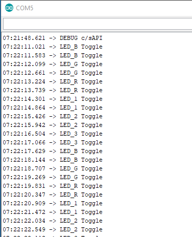

# TP1 de Sistemas Embebidos

## Configuración inicial

Se creó la carpeta projects/TP1 y se creó el repositorio de github "/pauloguarino/SE_TP1" en donde se guardan los contenidos de esta carpeta y todos los cambios del TP1.
Dentro de esta carpeta se creó el archivo README.md, se copiaron los archivos de sapi_examples/edu-ciaa-nxp/bare_metal/gpio/gpio_02_blinky, y se les cambió el nombre de "blinky.h" y "blinky.c" a "TP1.h" y "TP1.c" respectivamente.
Se modificó el archivo project.mk, comentando la línea:
```
PROJECT = sapi_examples/edu-ciaa-nxp/bare_metal/gpio/gpio_02_blinky
```
y agregando la línea
```
PROJECT = projects/TP1
```
En TP1.c se crean macros para la compilación condicional de los 6 puntos del TP1, llamadas TP1_X, donde X es el número del paso, y cada una de valor (X). Se divide el archivo en secciones para la compilación condicional con #if o #elif seguido por (TEST == TP1_X). El código copiado de blinky.c se lo deja en la primer sección, correspondiente a TP1_1.

Para configurar el debugger, primero se ejecuta la opción Clean project, luego Build project, y en la configuración del debugger se elije la opción de "GDB OpenOCD Debugging".
Para analizar el código y documentar lo que se ejecuta en cada sección, primero se elije la opción Run y se comprueba que la placa haga lo que se espera de haber leído el main, luego Terminate, y después se ejecuta la opción de Debug. Al debuggear se usan los botones de step over para avanzar en las líneas, step into para entrar a las funciones y ver qué hacen esas funciones, dónde se encuentran y que variables modifican, y step return para salir de la función.

## Debugging

**TP1_1**

Se comienza a analizar el código paso por paso mediante el debugger, entrando a las funciones principales para entender cómo funcionan.

La función boardConfig de sapi_board.c inicializa los registros de input/output (GPIOs) como input (algunos pines y las teclas) llamando a la función gpioConfig( GPIO_NAME, GPIO_INPUT ), y como output (otros pines y los LEDs) llamando a la función gpioConfig( GPIO_NAME, GPIO_OUTPUT ), donde GPIO_NAME es el nombre del registro. Además configura variables asociadas al clock, como el tick rate en tickInit en el archivo sapi_tick.c.

La variable asociada a los GPIOs es gpioMap_t.

El código consiste en un ciclo infinito que prende y apaga un LED con un delay. Para esto se llama a las funciones gpioWrite( LEDB, ON ) que prende el LED, o gpioWrite( LEDB, OFF ) que lo apaga, y delay(500) que genera un delay de 500 ms. La función gpioWrite modifica los registros de input/output. Esta se encuentra en sapi_gpio.c, en donde también se encuentra la función gpioConfig, gpioRead, gpioToggle, y gpioObtainPinConfig, todas relacionadas a los GPIOs. Se reemplazó las líneas de gpioWrite por gpioToggle( LEDG ) y el argumento de delay por 1000 y ejecutar el programa la placa ahora enciende y apaga el LED verde cada 1 segundo. La función delay, de sapi_delay.c, calcula el tiempo de delay contando los ticks y basándose en la variable volatil tickRateMS.

**TP1_2**

Se copia el código del archivo switches_led.c de la carpeta sapi_examples/edu-ciaa-nxp/bare_metal/gpio/gpio_01_switches_leds y se lo pega en la segunda sección de TP1.c, debajo de la línea
```
#elif (TEST == TP1_2)
```
Se modifica el valor de la macro TEST por (TP1_2) para debuggear la segunda sección y nuevamente se analiza el código.

Primero se inicializa la placa y los registros GPIO0 como input y GPIO1 como output. Después queda en un ciclo infinito donde checkea si hay una de las 4 teclas apretadas o el GPIO0 activo, en cuyo caso enciende uno de los LED, o activa el GPIO1 si GPIO0 está activo.

Algo a notar es que por cómo se usa gpioRead(TEC1), TEC1 (y todas las teclas) valen 0 cuando están apretadas, y 1 cuando no.

**TP1_3**

Se copia el código del archivo tickHook.c de la carpeta sapi_examples/edu-ciaa-nxp/bare_metal/tick_01_tickHook y se lo pega en la tercera sección de TP1.c, debajo de la línea
```
#elif (TEST == TP1_3)
```
Se modifica el valor de la macro TEST por (TP1_3) para debuggear la tercera sección y nuevamente se analiza el código.

Primero se inicializa la placa y se configura el tick rate para que se produzca un tick por cada 50 ms con la función tickConfig, definida en sapi_tick.c, que permite ajustar el tick rate, asociado a la variable tickRateMS de tipo tick_t, entre 1 y 50 ms. En ese mismo archivo está definida la función tickCallbackSet, que define la función a llamar cada vez que hay una interrupción por tick. Después de ajustar el tick rate se llama a esta función, pasandole como argumento la función myTickHook, que togglea el LED cuyo registro se le pasa como argumento. El código de esta sección consiste en un ciclo infinito en el que se van seteando distintos LEDs para que se prendan y apaguen con la interrupción del tick, y delays entre medio para dejar que los LEDs titilen durante un segundo por vez, con la frecuencia del tick rate.

Agregando un breakpoint dentro de myTickHook y seleccionando la opción Step Return una vez que el debugger llegó a ese breakpoint, se encontró que la función que maneja la interrupción por tick es SysTick_Handler, de sapi_tick.c. Lo que hace es simplemente aumentar el counter del tick y llamar a la función que había sido seteada con tickCallbackSet si es que fue seteada.


**TP1_4**

Se definen las constantes TICKRATE_1MS, TICKRATE_10MS y TICKRATE_50MS con valores de 1, 10 y 50, representando el número de milisegundos por tick. Ejemplo:
```
#define TICKRATE_1MS	(1)
```
También se definen las constantes LED_TOGGLE_100MS, LED_TOGGLE_500MS y LED_TOGGLE_1000MS con valores de 100, 500 y 1000, representando el tiempo de cambio del LED. Ejemplo:
```
#define LED_TOGGLE_100MS	(100)
```
Se definen las constantes “TICKRATE_MS” y “LED_TOGGLE_MS” y se las iguala a alguna de las constantes previamente definidas. Esto se hace de la siguiente forma:
```
#define TICKRATE_MS		(TICKRATE_50MS)	
#define LED_TOGGLE_MS	(LED_TOGGLE_500MS / TICKRATE_MS)
```
De ser necesario cambiar los tiempos de parpadeo de los leds, se debe cambiar una sola vez sobre los defines mostrados arriba. Tambien permite agregar nuevos tiempos modificando solo dos lineas de codigo. 

Para poder hacer más portable la versión, se buscó prescindir de la función delay(). La función myTickHook ahora setea el flag LED_Time_Flag, que hace que se descuente un contador. Cuando este llega a 0, en el tiempo LED_TOGGLE_MS, un LED se prende y se activa un flag que avisa que está encendido. Esto se encuentra dentro de un ciclo infinito que comienza con la función __WFI() que espera a que haya alguna interrupción para avanzar con la siguiente línea. Una vez que el contador llega nuevamente a 0, el led se apaga usando la función gpioToggle y se cambia de LED a togglear. El resultado final es una secuencia infinita en el que cada led se prende y se apaga de a uno.

**TP1_5**

Se instalaron los drivers de la placa (). Luego, se utilizó la IDE de Arduino, previamente configurada (COMx y baudrate 115200) la cual tiene una interfaz serie. Con esta se observaron los mensajes enviados por la placa. 
Para enviar un mensaje por el puerto serie primero se debió habilitar y configurar la comunicación. Esto se realizó con:
```
DEBUG_PRINT_ENABLE;
debugPrintConfigUart( UART_USB, 115200);
```

La segunda función está definida sobre sapi_print.c y es la que establece el medio de la comunicación (UART_USB) y la velocidad o baudrate (115200). Cabe aclarar que esta función llama a su vez a “void uartConfig( uartMap_t uart, uint32_t baudRate )”  definida en  “sapi_uart.c”. Esta función es la que realmente inicializa, setea el baudrate, habilita la transmisión y recepción y establece el largo de las tramas.

```
typedef enum{
   UART_GPIO = 0, // Hardware UART0 via GPIO1(TX), GPIO2(RX) pins on header P0
   UART_485  = 1, // Hardware UART0 via RS_485 A, B and GND Borns
   //UART_1  = 2, // Hardware UART1 not routed
   UART_USB  = 3, // Hardware UART2 via USB DEBUG port
   UART_ENET = 4, // Hardware UART2 via ENET_RXD0(TX), ENET_CRS_DV(RX) pins on header P0
   UART_232  = 5  // Hardware UART3 via 232_RX and 232_tx pins on header P1
} uartMap_t;
```

Por otro lado, ‘debugPrintString’  es la encargada de escribir el string por la UART y está definida sobre sapi_print.c. Para esto se usa la función “uartWriteString( printer, string )” que escribe caracter por caracter sobre la UART.
La función “uartWriteByte” lee el flag de TxReady y si lo encuentra vacío, carga el byte a enviar sobre la dirección de la UART (pUART->THR), en caso contrario espera.
Se agregó un array de strings para imprimir qué LED se está toggleando en cada caso.



**TP1_6**

Para la lectura de un botón, se utiliza la función “gpioRead( tecla )” como en TP1_2. Esta función busca el estado en el que se encuentra el pin y lo devuelve en una variable bool_t.
En esta función se definen las variables siguientes y se llama a la función “gpioObtainPinConfig( … )”. Esta última busca y devuelve las características o valores de configuración del pin (valores de las variables definidas abajo).

```
// define las variables en “gpioRead”
   bool_t ret_val     = OFF;

   int8_t pinNamePort = 0;
   int8_t pinNamePin  = 0;

   int8_t func        = 0;

   int8_t gpioPort    = 0;
   int8_t gpioPin     = 0;
```

Por último, se llama a “Chip_GPIO_ReadPortBit” que lee el estado del GPIO y devuelve un bool.

Esta vez myTickHook setea unos flags análogos a los definidos en TP1_4 y TP1_5, pero que solo se activan si alguna de las 4 teclas está apretada. El ciclo es igual al definido anteriormente, pero ahora en vez de llevar un contador según el tiempo que pasaba, se tiene un contador que guarda el tiempo en que estuvo apretada alguna tecla. Cuando en total se haya apretado la tecla por más de BUTTON_STATUS_MS milisegundos (macro análoga a LED_TOGGLE_MS), se ejecuta la siguiente acción siguiendo los mismos pasos que en el TP1_5: se togglea el LED, se manda la cadena por UART, y se selecciona otro LED si ya se apagó y prendió una vez.
Además está el flag toggled que registra si un LED fue toggleado y no permite volver a togglear hasta que se suelte la tecla apretada.
